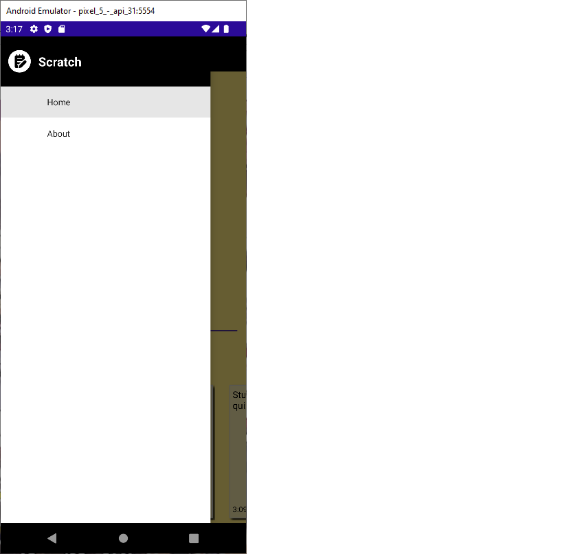

# Scratch
Note-taking mobile application created using .NET MAUI framework.

[Git Repo](https://github.com/grepsedawkcat/dotnet-maui-application)  

## .NET MAUI Bugs
* Data binding does not work when setting text in editor control
* Windows OS emulator does not properly display certain effects and controls

## Notes
* Tested on Android emulator (Pixel 5, API 31)
* Will update when .NET MAUI is less buggy
* Uses multi-line truncate solution (Android specific) provided at [https://github.com/hartez/MultilineTruncate](https://github.com/hartez/MultilineTruncate) 

