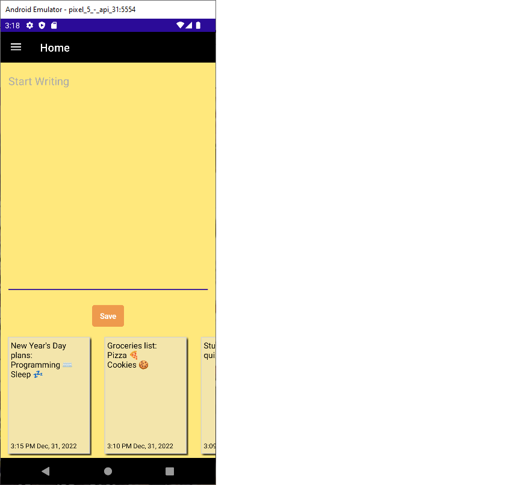

# Scratch
Cross-platform note-taking mobile application created using .NET MAUI framework.

[Git Repo](https://github.com/grepsedawkcat/dotnet-maui-application)  

## .NET MAUI Bugs
* Data binding does not work (visually) when setting text in a editor control
* Windows OS emulator does not properly display most effects and controls
* CollectionView control display is bugged when using data binding?

## Notes
* Tested on Android emulator (Pixel 5, API 31)
* Will update to use MVVM design pattern when .NET MAUI is less buggy
* Uses multi-line truncate solution (Android specific) provided at [https://github.com/hartez/MultilineTruncate](https://github.com/hartez/MultilineTruncate)
* APK files can be found [here](https://github.com/grepsedawkcat/dotnet-maui-application/tree/main/bin/Release/net6.0-android/publish)

